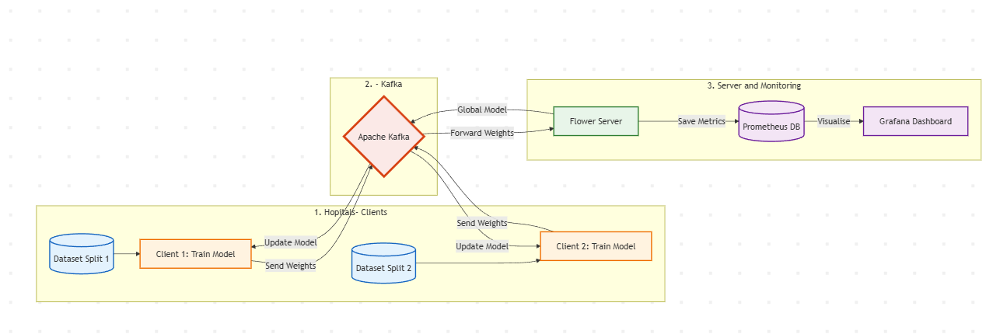

# 🫀 Cardiologie Federated Learning Platform
### Système Distribué et Scalable pour la Prédiction des Maladies Cardiovasculaires  
*(Apache Spark • Apache Kafka • Federated Learning • Docker • Grafana)*

---

## 📌 Présentation Générale

Ce projet a pour objectif de concevoir une **plateforme distribuée de prédiction des maladies cardiovasculaires**, respectant les contraintes strictes de **confidentialité des données médicales**, tout en étant **scalable**, **tolérante aux pannes** et **prête pour un déploiement réel en milieu hospitalier**.

Le système repose sur une architecture moderne combinant :
- **Federated Learning** (apprentissage fédéré)
- **Apache Spark Streaming** (traitement de données volumineuses en temps réel)
- **Apache Kafka** (communication asynchrone et distribuée)
- **Docker & Docker Compose** (orchestration)
- **Prometheus & Grafana** (monitoring)

---

## 🎯 Objectifs du Projet

- Permettre à plusieurs hôpitaux d’entraîner un modèle commun **sans jamais partager leurs données brutes**
- Traiter des **volumes importants de données médicales** en temps réel
- Assurer une architecture **modulaire, extensible et industrialisable**
- Fournir une **preuve de concept académique avancée**, proche d’un système réel

---

## 🧠 Architecture Conceptuelle




---

## 📁 Structure du Projet

Cardio_Federated_Project/
│
├── client/ # Client hospitalier
│ ├── client.py # Client Kafka + Flower
│ ├── spark_manager.py # Configuration Spark
│ ├── preprocessing.py # Nettoyage & Streaming
│ ├── trainer.py # Entraînement local (PyTorch)
│ ├── Dockerfile
│ └── requirements.txt
│
├── server/ # Serveur central
│ ├── server.py # Agrégation fédérée
│ ├── strategy.py # FedAvg (Flower)
│ ├── Dockerfile
│ └── requirements.txt
│
├── data/
│ ├── raw/ # Données originales (non versionnées)
│ ├── incoming/ # Dossier surveillé par Spark Streaming
│ └── processed/ # Données nettoyées
│
├── simulator/
│ └── data_injector.py # Simulation de flux temps réel
│
├── infrastructure/ # Kafka, Monitoring
│
├── docker-compose.yml
├── requirements-dev.txt # Environnement global de développement
├── .gitignore
└── README.md

---

## 🚀 Démarrage Rapide

1. **Prérequis** :
   - Docker & Docker Compose
   - Python 3.10+

2. **Installation enveronement** :
   ```bash
   git clone https://github.com/your-repo/Cardio_Federated_Project.git
   cd Cardio_Federated_Project
   conda create -n cardio-env python=3.10
   conda activate cardio-env
   pip install -r requirements-dev.txt
   ```

3. **Installation java openJDK** :

   ```bash
   sudo apt install openjdk-11-jdk -y

   java -version

   echo 'export JAVA_HOME=/usr/lib/jvm/java-11-openjdk-amd64' >> ~/.bashrc
   echo 'export PATH=$JAVA_HOME/bin:$PATH' >> ~/.bashrc
   source ~/.bashrc

   echo $JAVA_HOME
   ```

4. **Des outils suplementaires** :
```bash
sudo apt install tree htop curl -y
```

5. **Lancement** :
```bash
docker-compose up --build
```

---

# 📘 Cardiology Federated Learning — Base de données

## 📌 Objectif

Cette base de données est conçue pour le projet **Cardiology Federated Learning**.  
Elle permet de :

- Stocker les modèles globaux fédérés.
- Enregistrer la précision (accuracy) par round.
- Sélectionner le meilleur modèle global selon ses performances.

---

## 🧰 Technologies utilisées

- **PostgreSQL** — Système de gestion de base de données relationnelle.  
- **pgAdmin** — Outil web pour administrer PostgreSQL.  
- **Docker / Docker Compose** — Pour virtualiser et orchestrer les services.

---

## 🗂️ Arborescence recommandée

cardiologie-project/
├── database/
│ ├── docker-compose.yml
│ └── generate_table.py
├── server/
├── client/
└── README.md


---

## 🐳 1️⃣ Lancer PostgreSQL et pgAdmin avec Docker

### 📄 `database/docker-compose.yml`


### ▶️ Démarrer les services

 Depuis le dossier `database/`, exécute la commande :

```bash
docker-compose up -d
```


---

## 🧩 2️⃣ Configuration de pgAdmin

### 🌐 Accès à l’interface

Ouvre ton navigateur à l’adresse :  
👉 [http://localhost:5050](http://localhost:5050)

### 🔐 Informations de connexion

- **Email :** admin.com  
- **Mot de passe :** admin 

### ➕ Ajouter le serveur PostgreSQL

Dans **pgAdmin** :

1. Clique sur *Add New Server*.  
2. **General → Name :** `Cardio_Postgres`  
3. **Connection →**  
   - Host name : `postgres`  
   - Port : `5432`  
   - Database : `database_card`  
   - Username : `admin`  
   - Password : `cardio111`  
   - ✔️ Coche *Save password*  
4. Clique sur **Save** ✅

---

## 🧱 3️⃣ Création des tables SQL
Depuis le dossier `database/generate_tables.py`, exécute la commande :

```bash
python generate_tables.py
```

## 📚 Documentation

- [Documentation](https://github.com/your-repo/Cardio_Federated_Project/blob/main/README.md)

---


